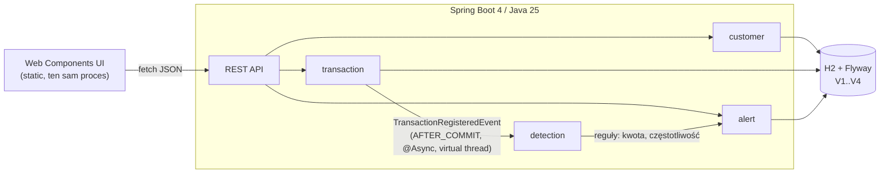
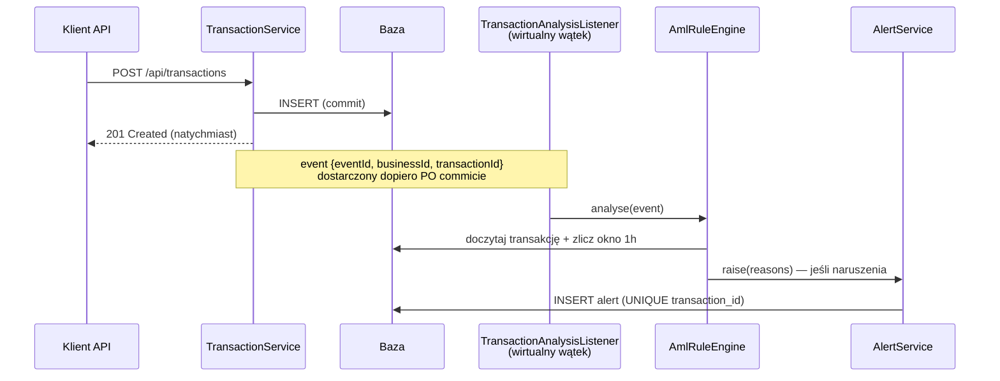

# Monitoring Transakcji — moduł AML

[](https://github.com/Jakub-Mikolajczyk-pl/monitoring-transactions/actions/workflows/ci.yml)

System do monitorowania transakcji finansowych (zadanie rekrutacyjne): rejestracja
klientów i transakcji, **asynchroniczna** analiza reguł AML na **wirtualnych wątkach**,
generowanie alertów oraz obsługa decyzji analityka z pełną historią audytową
i ochroną przed utraconymi aktualizacjami (optimistic locking → HTTP 409).

**Stack:** Java 25 (LTS) · Spring Boot 4.0.7 · H2 + Flyway · springdoc-openapi ·
czyste Web Components (bez bundlera i frameworka).

---

## 1. Jak uruchomić

Wymaganie: **JDK 25** (np. [Eclipse Temurin](https://adoptium.net/temurin/releases/?version=25)).
Niczego więcej — baza H2 działa w pamięci, frontend serwuje ten sam proces.

```bash
./mvnw spring-boot:run        # Windows: mvnw.cmd spring-boot:run
```

| Adres | Co tam jest |
|---|---|
| http://localhost:8080 | aplikacja (UI analityka) |
| http://localhost:8080/swagger-ui.html | dokumentacja API (OpenAPI, generowana z kodu) |
| http://localhost:8080/h2-console | konsola bazy (`jdbc:h2:mem:amldb`, user `sa`, bez hasła) |
| http://localhost:8080/actuator/health | health check |

Testy (jednostkowe + integracyjne + reguły architektury):

```bash
./mvnw clean verify
```

### Scenariusz demo (60 sekund)

```bash
# 1. klient w kontekście biznesowym BANK_A
curl -s -X POST localhost:8080/api/customers -H "Content-Type: application/json" \
  -d '{"businessId":"BANK_A","firstName":"Jan","lastName":"Kowalski"}'
# zapisz "id" z odpowiedzi jako CUSTOMER_ID

# 2. transakcja powyżej progu 2000 -> asynchronicznie powstanie alert
curl -s -X POST localhost:8080/api/transactions -H "Content-Type: application/json" \
  -d '{"businessId":"BANK_A","customerId":"CUSTOMER_ID","amount":2500.50,"currency":"PLN","transactionDate":"2026-06-11T10:30:00Z"}'

# 3. alert pojawia się po chwili (analiza działa w tle)
curl -s localhost:8080/api/alerts

# 4. decyzja analityka (alertVersion z odpowiedzi powyżej; konflikt wersji -> 409)
curl -s -X POST localhost:8080/api/alerts/ALERT_ID/decisions -H "Content-Type: application/json" \
  -d '{"decision":"APPROVE","comment":"Zweryfikowano z klientem","alertVersion":0}'
```

Ten sam przepływ jest dostępny klikalnie w UI (`Transakcje` → `Alerty` → szczegóły → decyzja).

---

## 2. Architektura

Modularny monolit, pakiety per funkcja biznesowa. Granice pakietów są **egzekwowane
testem** ([ArchitectureTest](src/test/java/pl/jakubmikolajczyk/monitoring/ArchitectureTest.java), ArchUnit), nie tylko konwencją.



Przepływ asynchronicznej analizy (sedno zadania, §4.3–4.4 PDF):



| Pakiet | Odpowiedzialność |
|---|---|
| `customer` | rejestr klientów; w pełni niezależny |
| `transaction` | niemutowalne transakcje, wyszukiwanie, publikacja zdarzenia |
| `detection` | nasłuch zdarzeń, **zamknięty katalog reguł** (sealed), silnik |
| `alert` | alerty, decyzje analityka (append-only), kompozycja szczegółów |
| `common` | błędy RFC 9457, identyfikatory UUIDv7, czas, konfiguracja |

Model danych: `customers ← transactions ← alerts ← alert_decisions`, schemat
w migracjach Flyway [V1](src/main/resources/db/migration/V1__create_customers.sql)–[V4](src/main/resources/db/migration/V4__create_alert_decisions.sql) — historia schematu opowiada tę samą historię co `git log`.

---

## 3. Decyzje projektowe

Pełny rejestr z odrzuconymi alternatywami: [docs/adr](docs/adr/README.md).
Analiza wymagań i interpretacje niejednoznaczności: [docs/requirements.md](docs/requirements.md).

| Decyzja | Dlaczego (skrót) | ADR |
|---|---|---|
| Java 25 + Spring Boot **4.0.7** (świadomie nie 4.1.0 z 10.06.2026) | najnowszy patch sprawdzonej linii zamiast 2-dniowego minora — tak się wybiera wersje w banku | [0001](docs/adr/0001-java-25-spring-boot-4.md) |
| `businessId` = **kontekst biznesowy**, nie unikalny id rekordu | jedyna interpretacja spójna z przykładami PDF i wymaganym filtrem wyszukiwania | [0003](docs/adr/0003-businessid-business-context.md) |
| Transakcje **niemutowalne**; czas biznesowy ≠ czas systemowy | audyt + deterministyczne okna reguł | [0005](docs/adr/0005-immutable-transactions.md) |
| Zdarzenia in-app, `AFTER_COMMIT` + `@Async` na **wirtualnych wątkach** | analiza nigdy nie widzi niezacommitowanych danych; rejestracja nie czeka | [0006](docs/adr/0006-async-in-app-events.md) |
| **Jeden alert na transakcję**, scalone powody, unikalność w bazie | idempotencja przy ponownym przetworzeniu; mniej szumu dla analityka | [0007](docs/adr/0007-single-alert-merged-reasons.md) |
| Decyzje **append-only** + wersja alertu w żądaniu → 409 | lost update między analitykami jest jawny, nie cichy | [0008](docs/adr/0008-optimistic-locking-decisions.md) |
| Błędy zawsze jako `application/problem+json` (RFC 9457) | jeden parser błędów po stronie klientów; samoopisujący kontrakt | [0009](docs/adr/0009-rest-contract-problemdetail.md) |
| UI: czyste Web Components, `adoptedStyleSheets`, zero build stepu | technologia narzucona zadaniem, użyteczność > efekty | [0010](docs/adr/0010-frontend-web-components.md) |
| Identyfikatory **UUIDv7** generowane w aplikacji | porządek czasowy = przyjazność indeksom; id znane przed zapisem | [0011](docs/adr/0011-uuidv7-identifiers.md) |

Wykorzystane nowości Javy (rekordy, sealed types, pattern matching, wirtualne wątki…)
z mapowaniem na konkretne pliki: **[docs/java-features.md](docs/java-features.md)**.

---

## 4. API w pigułce

| Endpoint | Opis |
|---|---|
| `POST /api/customers` | rejestracja klienta → `201` |
| `GET /api/customers` | lista klientów |
| `POST /api/transactions` | rejestracja transakcji → `201` (analiza async) |
| `GET /api/transactions?businessId=…&customerId=…&dateFrom=…&dateTo=…` | wyszukiwanie; `businessId` **wymagany** |
| `GET /api/alerts?status=OPEN` | kolejka alertów (filtr opcjonalny) |
| `GET /api/alerts/{id}` | szczegóły: alert + transakcja + klient + historia decyzji |
| `POST /api/alerts/{id}/decisions` | decyzja `APPROVE`/`REJECT` + komentarz + `alertVersion` |

Statusy błędów: `400` walidacja, `404` brak zasobu, `409` konflikt wersji decyzji,
`422` naruszenie spójności biznesowej (np. `businessId` transakcji ≠ `businessId` klienta).

---

## 5. Jak sprawdziłem poprawność rozwiązania

1. **38 testów automatycznych** (`./mvnw clean verify`), w tym:
   - jednostkowe testy reguł z wstrzykniętym zegarem — granice progów (`2000.00` czysto,
     `2000.01` alert; 5 transakcji czysto, 6 → alert) i zakotwiczenie okna w czasie biznesowym;
   - integracyjne testy API (pełny kontekst Springa + H2 + Flyway): walidacja z błędami
     per pole, filtry wyszukiwania, statusy 400/404/409/422;
   - testy asynchroniczne z **Awaitility** (bez `sleep`): transakcja 2500 → alert `OPEN`
     pojawia się w tle; 6. transakcja w godzinie → `HIGH_FREQUENCY`; obie reguły naraz →
     jeden alert ze scalonymi powodami;
   - **deterministyczny** test konfliktu: zapis decyzji ze stale `alertVersion` → `409`,
     historia bez zmian (zamiast wyścigu wątków — odtworzenie nieaktualnej wersji);
   - reguły architektury (ArchUnit): brak cykli, `customer` niezależny, `detection`
     niewidoczny dla funkcji biznesowych, `common` jako liść.
2. **Smoke test manualny w UI** (scenariusz powtórzony przed oddaniem):
   dodanie klienta → transakcja 2500,50 zł → alert na liście → szczegóły → decyzja
   APPROVE → wpis na osi czasu → symulacja drugiego analityka (decyzja przez API) →
   ponowny zapis z UI kończy się komunikatem o konflikcie i odświeżeniem danych.
3. **Walidacja schematu na starcie**: Hibernate w trybie `validate` przeciwko migracjom
   Flyway — rozjazd encji i SQL zatrzymuje aplikację, zanim zrobi to produkcja.
4. **CI** (GitHub Actions): pełny `verify` na Temurin 25 przy każdym pushu.

---

## 6. Czy używałem AI — jak i do czego

Tak — świadomie i pod kontrolą, analogicznie do pracy z parą programistyczną:

- **Do czego:** szkielet dokumentów (ADR-y, ten README), boilerplate warstw
  (encje/DTO/kontrolery), szkice testów, research wersji ekosystemu Spring Boot 4
  (potwierdzenie kompatybilności springdoc 3.x ↔ Boot 4.0.x), przygotowanie czystej
  historii commitów. Commity współtworzone z AI mają stopkę `Co-Authored-By`.
- **Co pozostało po mojej stronie:** wymagania i ich interpretacja (w tym kluczowa
  decyzja o semantyce `businessId`), wybór wersji i architektury, model danych,
  semantyka reguł i kodów HTTP, przegląd każdej linii przed commitem.
- **Jak weryfikowałem wynik pracy AI:** przez testy z sekcji 5 (każdy slice kończył
  się zielonym `verify`), ręczny smoke test UI oraz przegląd diffów commit po commicie.
  AI bywa pewne siebie i nieaktualne — np. pakiety testowe Boot 4 zmieniły lokalizacje
  (`@AutoConfigureMockMvc` żyje dziś w `org.springframework.boot.webmvc.test.autoconfigure`),
  co wyszło natychmiast na kompilacji, nie na produkcji.

---

## 7. Świadome uproszczenia i ścieżki ewolucji

| Uproszczenie (dlaczego OK w zadaniu) | Ścieżka produkcyjna |
|---|---|
| H2 in-memory (zero-setup dla oceniającego) | PostgreSQL + Testcontainers w testach; te same migracje Flyway |
| Zdarzenia w pamięci aplikacji (PDF dopuszcza wprost) | Transactional Outbox + broker (Kafka/Rabbit) — granica modułu `detection` już na to gotowa |
| Próg kwotowy ślepy na walutę (PDF: „np. 2000 zł") | progi per waluta lub normalizacja FX |
| Brak paginacji list | `Pageable` + nagłówki strony |
| Brak uwierzytelniania (poza zakresem PDF) | Spring Security + OIDC; `decidedBy` przy decyzjach |
| `reason` jako CSV w jednej kolumnie (model z PDF) | tabela `alert_reasons` 1:N |
| Brak testów jednostkowych UI | Playwright dla ścieżek krytycznych |

## 8. Nawigacja po repozytorium

```
docs/requirements.md        analiza wymagań + macierz traceability (REQ-xx → kod → test)
docs/adr/                   11 decyzji architektonicznych z odrzuconymi alternatywami
docs/implementation-plan.md plan dostarczania pionowymi przyrostami (S0–S8)
docs/git-convention.md      konwencja commitów (Conventional Commits + Refs: REQ-xx)
docs/java-features.md       mapa nowości Javy 14–25 użytych w projekcie
src/main/resources/db/      migracje Flyway V1–V4
src/main/resources/static/  frontend (Web Components, ES modules)
```

Historia commitów jest częścią rozwiązania: `git log --oneline` czyta się jak plan
z `docs/implementation-plan.md`, a stopki `Refs:` wiążą każdy commit z wymaganiami.
