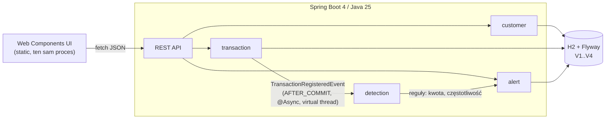
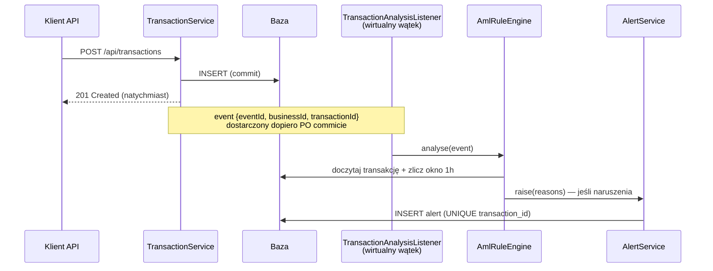

# Monitoring Transakcji — moduł AML

[](https://github.com/Jakub-Mikolajczyk-pl/monitoring-transactions/actions/workflows/ci.yml)

System do monitorowania transakcji finansowych (zadanie rekrutacyjne): rejestracja
klientów i transakcji, **asynchroniczna** analiza reguł AML na **wirtualnych wątkach**,
generowanie alertów oraz obsługa decyzji analityka z pełną historią audytową
i ochroną przed utraconymi aktualizacjami (optimistic locking → HTTP 409).

**Stack:** Java 25 (LTS) · Spring Boot 4.0.7 · H2 + Flyway · springdoc-openapi ·
czyste Web Components (bez bundlera i frameworka).

---

## 1. Jak uruchomić

Wymaganie dla aplikacji: **JDK 25** (np. [Eclipse Temurin](https://adoptium.net/temurin/releases/?version=25)).
Baza H2 działa w pamięci, frontend serwuje ten sam proces. Wizualne demo Playwright
wymaga dodatkowo Node.js/npm.

```bash
./mvnw spring-boot:run        # Windows: mvnw.cmd spring-boot:run
```

| Adres | Co tam jest |
|---|---|
| http://localhost:8080 | aplikacja (UI analityka) |
| http://localhost:8080/swagger-ui.html | dokumentacja API (OpenAPI, generowana z kodu) |
| http://localhost:8080/h2-console | konsola bazy (`jdbc:h2:mem:amldb`, user `sa`, bez hasła) |
| http://localhost:8080/actuator/health | health check |

Testy backendu i reguł architektury:

```bash
./mvnw clean verify
```

Po uruchomieniu aplikacji dostępna jest też strona testów komponentów frontendu:

| Adres | Co sprawdza |
|---|---|
| http://localhost:8080/test/index.html | testy jednostkowe Web Components z podmienionym `fetch` |

Wizualne demo dla reviewera prowadzi przeglądarkę krok po kroku przez UI:

```bash
npm install
npx playwright install chromium

# terminal 1
mvnw.cmd spring-boot:run

# terminal 2
npm run demo
```

Opcjonalnie: `npm run demo:trace` zapisuje trace/video w `target/playwright-results`,
a `npm run demo:report` otwiera raport HTML.

### Scenariusz demo (60 sekund)

```bash
# 1. klient w kontekście biznesowym BANK_A
curl -s -X POST localhost:8080/api/customers -H "Content-Type: application/json" \
  -d '{"businessId":"BANK_A","firstName":"Jan","lastName":"Kowalski"}'
# zapisz "id" z odpowiedzi jako CUSTOMER_ID

# 2. transakcja powyżej progu 2000 -> asynchronicznie powstanie alert
curl -s -X POST localhost:8080/api/transactions -H "Content-Type: application/json" \
  -d '{"businessId":"BANK_A","customerId":"CUSTOMER_ID","amount":2500.50,"currency":"PLN","transactionDate":"2026-06-11T10:30:00Z"}'

# 3. alert pojawia się po chwili (analiza działa w tle)
curl -s localhost:8080/api/alerts

# 4. decyzja analityka (alertVersion z odpowiedzi powyżej; konflikt wersji -> 409)
curl -s -X POST localhost:8080/api/alerts/ALERT_ID/decisions -H "Content-Type: application/json" \
  -d '{"decision":"APPROVE","comment":"Zweryfikowano z klientem","alertVersion":0}'
```

Ten sam przepływ jest dostępny klikalnie w UI (`Transakcje` → `Alerty` → szczegóły → decyzja).

---

## 2. Architektura

Modularny monolit, pakiety per funkcja biznesowa. Granice pakietów są **egzekwowane
testem** ([ArchitectureTest](src/test/java/pl/jakubmikolajczyk/monitoring/ArchitectureTest.java), ArchUnit), nie tylko konwencją.



Przepływ asynchronicznej analizy (sedno zadania, §4.3–4.4 PDF):



| Pakiet | Odpowiedzialność |
|---|---|
| `customer` | rejestr klientów; w pełni niezależny |
| `transaction` | niemutowalne transakcje, wyszukiwanie, publikacja zdarzenia |
| `detection` | nasłuch zdarzeń, **zamknięty katalog reguł** (sealed), silnik |
| `alert` | alerty, decyzje analityka (append-only), kompozycja szczegółów |
| `common` | błędy RFC 9457, identyfikatory UUIDv7, czas, konfiguracja |

Model danych: `customers ← transactions ← alerts ← alert_decisions`, schemat
w migracjach Flyway [V1](src/main/resources/db/migration/V1__create_customers.sql)–[V4](src/main/resources/db/migration/V4__create_alert_decisions.sql) — historia schematu opowiada tę samą historię co `git log`.

---

## 3. Decyzje projektowe

Pełny rejestr z odrzuconymi alternatywami: [docs/adr](docs/adr/README.md).
Analiza wymagań i interpretacje niejednoznaczności: [docs/requirements.md](docs/requirements.md).

| Decyzja | Dlaczego (skrót) | ADR |
|---|---|---|
| Java 25 + Spring Boot **4.0.7** (świadomie nie 4.1.0 z 10.06.2026) | najnowszy patch sprawdzonej linii zamiast 2-dniowego minora — tak się wybiera wersje w banku | [0001](docs/adr/0001-java-25-spring-boot-4.md) |
| Maven Wrapper + H2 in-memory + Flyway + `ddl-auto=validate` | zero setupu dla oceniającego, ale schemat pozostaje wersjonowany i audytowalny | [0002](docs/adr/0002-maven-h2-flyway.md) |
| `businessId` = **kontekst biznesowy**, nie unikalny id rekordu | jedyna interpretacja spójna z przykładami PDF i wymaganym filtrem wyszukiwania | [0003](docs/adr/0003-businessid-business-context.md) |
| Pieniądze jako `BigDecimal` + ISO 4217; próg bez FX | brak błędów reprezentacji; wielowalutowość świadomie poza zakresem zadania | [0004](docs/adr/0004-money-bigdecimal.md) |
| Transakcje **niemutowalne**; czas biznesowy ≠ czas systemowy | audyt + deterministyczne okna reguł | [0005](docs/adr/0005-immutable-transactions.md) |
| Zdarzenia in-app, `AFTER_COMMIT` + `@Async` na **wirtualnych wątkach** | analiza nigdy nie widzi niezacommitowanych danych; rejestracja nie czeka | [0006](docs/adr/0006-async-in-app-events.md) |
| **Jeden alert na transakcję**, scalone powody, unikalność w bazie | idempotencja przy ponownym przetworzeniu; mniej szumu dla analityka | [0007](docs/adr/0007-single-alert-merged-reasons.md) |
| Decyzje **append-only** + wersja alertu w żądaniu → 409 | lost update między analitykami jest jawny, nie cichy | [0008](docs/adr/0008-optimistic-locking-decisions.md) |
| Błędy jako `ProblemDetail`, statusy 400/404/409/422, paginacja z limitem | jeden kontrakt błędów i bezpieczne listy zamiast nieograniczonych odpowiedzi | [0009](docs/adr/0009-rest-contract-problemdetail.md) |
| UI: czyste Web Components, Shadow DOM, CSS przez `<link>`, zero build stepu | technologia narzucona zadaniem; Node służy tylko do opcjonalnego demo Playwright | [0010](docs/adr/0010-frontend-web-components.md) |
| Identyfikatory **UUIDv7** generowane w aplikacji | porządek czasowy = przyjazność indeksom; id znane przed zapisem | [0011](docs/adr/0011-uuidv7-identifiers.md) |
| Jawne granice transakcji w serwisach + `open-in-view=false` | transakcyjność jest widoczna w kodzie, a analiza AML używa krótkich, celowych transakcji | [0012](docs/adr/0012-transaction-boundaries.md) |

Wykorzystane nowości Javy (rekordy, sealed types, pattern matching, wirtualne wątki…)
z mapowaniem na konkretne pliki: **[docs/java-features.md](docs/java-features.md)**.

---

## 4. API w pigułce

| Endpoint | Opis |
|---|---|
| `POST /api/customers` | rejestracja klienta → `201` |
| `GET /api/customers` | lista klientów |
| `POST /api/transactions` | rejestracja transakcji → `201` (analiza async) |
| `GET /api/transactions?businessId=…&customerId=…&dateFrom=…&dateTo=…` | wyszukiwanie; `businessId` **wymagany** |
| `GET /api/alerts?status=OPEN` | kolejka alertów (filtr opcjonalny) |
| `GET /api/alerts/{id}` | szczegóły: alert + transakcja + klient + historia decyzji |
| `POST /api/alerts/{id}/decisions` | decyzja `APPROVE`/`REJECT` + komentarz + `alertVersion` |

Statusy błędów: `400` walidacja, `404` brak zasobu, `409` konflikt wersji decyzji,
`422` naruszenie spójności biznesowej (np. `businessId` transakcji ≠ `businessId` klienta).

---

## 5. Jak sprawdziłem poprawność rozwiązania

1. **Pakiet Maven (`./mvnw clean verify`)** — testy jednostkowe, integracyjne i reguły
   architektury, w tym:
   - jednostkowe testy reguł z wstrzykniętym zegarem — granice progów (`2000.00` czysto,
     `2000.01` alert; 5 transakcji czysto, 6 → alert) i zakotwiczenie okna w czasie biznesowym;
   - integracyjne testy API (pełny kontekst Springa + H2 + Flyway): walidacja z błędami
     per pole, filtry wyszukiwania, statusy 400/404/409/422;
   - testy asynchroniczne z **Awaitility** (bez `sleep`): transakcja 2500 → alert `OPEN`
     pojawia się w tle; 6. transakcja w godzinie → `HIGH_FREQUENCY`; obie reguły naraz →
     jeden alert ze scalonymi powodami;
   - **deterministyczny** test konfliktu: zapis decyzji ze stale `alertVersion` → `409`,
     historia bez zmian (zamiast wyścigu wątków — odtworzenie nieaktualnej wersji);
   - reguły architektury (ArchUnit): brak cykli, `customer` niezależny, `detection`
     niewidoczny dla funkcji biznesowych, `common` jako liść.
2. **Testy komponentów w przeglądarce (`/test/index.html`)** — 15 przypadków bez Node/npm:
   helpery formatowania, wrapper `api.js`, mapowanie `problem+json`, emitowanie zdarzeń
   z formularza klienta, błędy pól i renderowanie alertów z koperty paginacji.
3. **Wizualne demo Playwright (`npm run demo`)** — headed Chromium pokazuje reviewerowi
   kolejne kroki w UI: rejestrację klienta, rejestrację transakcji normalnej i podejrzanej,
   wyszukiwanie historii, kolejkę alertów, szczegóły alertu oraz zapis decyzji analityka.
   Demo używa żywego backendu i unikalnego `businessId`, więc można je powtarzać bez
   czyszczenia bazy.
4. **Smoke test manualny w UI** (scenariusz powtórzony przed oddaniem):
   dodanie klienta → transakcja 2500,50 zł → alert na liście → szczegóły → decyzja
   APPROVE → wpis na osi czasu → symulacja drugiego analityka (decyzja przez API) →
   ponowny zapis z UI kończy się komunikatem o konflikcie i odświeżeniem danych.
5. **Walidacja schematu na starcie**: Hibernate w trybie `validate` przeciwko migracjom
   Flyway — rozjazd encji i SQL zatrzymuje aplikację, zanim zrobi to produkcja.
6. **CI** (GitHub Actions): pełny `verify` na Temurin 25 przy każdym pushu.

---

## 6. Czy używałem AI — jak i do czego

Tak, ale nie jako autora zastępczego. AI było narzędziem roboczym do przyspieszenia
pisania i sprawdzania wariantów; odpowiedzialność za zakres, decyzje, kod i commity
pozostaje po mojej stronie.

- **Gdzie AI pomagało:** szkice ADR-ów i README, warianty boilerplate'u
  (encje/DTO/kontrolery), checklisty testów, research świeżych zmian w ekosystemie
  Spring Boot 4 oraz drugi czytelnik dla diffów i opisów commitów.
- **Czego AI nie robiło za mnie:** nie ustalało semantyki wymagań, nie wybierało
  architektury, nie zatwierdzało kompromisów i nie było źródłem prawdy o działaniu
  systemu. Po mojej stronie były: przełożenie PDF na REQ/NFR, decyzja o `businessId`,
  model danych, granice transakcji, semantyka reguł AML, kody HTTP, historia decyzji,
  UI analityka, dobór uproszczeń oraz odrzucanie sugestii, które nie pasowały do zadania.
- **Jak kontrolowałem wynik:** każdy przyrost przechodził przez kompilację, testy
  z sekcji 5, ręczny przegląd UI i przegląd diffów przed commitem. Historia commitów
  ma stopki `Refs:` wiążące zmiany z wymaganiami i ADR-ami.
  Przykład kontroli: AI potrafiło podać nieaktualne pakiety testowe Boot 4, a kompilacja
  szybko wymusiła poprawne importy (`org.springframework.boot.webmvc.test.autoconfigure`).

---

## 7. Świadome uproszczenia i ścieżki ewolucji

| Uproszczenie (dlaczego OK w zadaniu) | Ścieżka produkcyjna |
|---|---|
| H2 in-memory (zero-setup dla oceniającego) | PostgreSQL + Testcontainers w testach; te same migracje Flyway |
| Zdarzenia w pamięci aplikacji (PDF dopuszcza wprost) | Transactional Outbox + broker (Kafka/Rabbit) — granica modułu `detection` już na to gotowa |
| Próg kwotowy ślepy na walutę (PDF: „np. 2000 zł") | progi per waluta lub normalizacja FX |
| Brak uwierzytelniania (poza zakresem PDF) | Spring Security + OIDC; `decidedBy` przy decyzjach |
| `reason` jako CSV w jednej kolumnie (model z PDF) | tabela `alert_reasons` 1:N |
| Paginacja offsetowa, stały sort | keyset/cursor + parametr `sort` (proste rozszerzenie `Pages`) |
| Brak danych kontaktowych klienta (e-mail poza modelem z PDF) | opcjonalne pole z `@Email`; pewny dowód istnienia adresu daje dopiero wiadomość potwierdzająca |
| Testy komponentów w przeglądarce (`/test/index.html`), nie w CI mavenowym | te same specyfikacje pod Playwright jako krok CI ([ADR-0010](docs/adr/0010-frontend-web-components.md#testowanie-ui)) |
| Demo Playwright jest nastawione na reviewera, nie CI | wariant headless w CI z tym samym scenariuszem i izolowanym `businessId` |

> Dane startowe: aplikacja wstaje z gotowym zestawem demo (Flyway `db/seed`, profil
> runtime) — 5 klientów, 16 transakcji, 3 alerty. Testy używają profilu `test`, który
> ten seed wyłącza. Decyzje przeglądowe (paginacja z limitem, catch-all 500, rozdział
> stylów, testy komponentów, granice transakcji) są udokumentowane w odpowiednich
> [ADR-ach](docs/adr/README.md) oraz [wymaganiach](docs/requirements.md).

## 8. Nawigacja po repozytorium

```
docs/requirements.md        analiza wymagań + macierz traceability (REQ-xx → kod → test)
docs/adr/                   12 decyzji architektonicznych z odrzuconymi alternatywami
docs/implementation-plan.md plan dostarczania pionowymi przyrostami (S0–S8)
docs/git-convention.md      konwencja commitów (Conventional Commits + Refs: REQ-xx)
docs/java-features.md       mapa nowości Javy 14–25 użytych w projekcie
src/main/resources/db/migration  migracje schematu Flyway V1–V4
src/main/resources/db/seed       dane demo (V900, tylko runtime)
src/main/resources/static/  frontend (Web Components, ES modules) + testy /test/index.html
tests/demo/                 wizualne demo Playwright uruchamiane przez npm run demo
```

Historia commitów jest częścią rozwiązania: `git log --oneline` czyta się jak plan
z `docs/implementation-plan.md`, a stopki `Refs:` wiążą każdy commit z wymaganiami.
